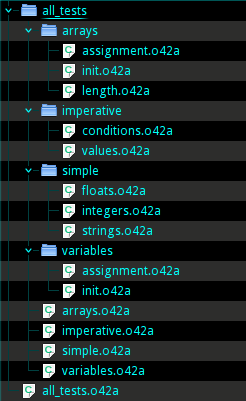

Source Files
============
<!--
Copyright (C) 2010-2013 Ruslan Lopatin.
Permission is granted to copy, distribute and/or modify this document
under the terms of the GNU Free Documentation License, Version 1.3
or any later version published by the Free Software Foundation;
with no Invariant Sections, no Front-Cover Texts, and no Back-Cover Texts.
A copy of the license is included in the section entitled "GNU
Free Documentation License".
-->

An o42a source file is a text file with `.o42a` extension. The source file
encoding considered UTF-8, unless explicitly [overridden](o42ac.html). Each
project has at least one such file.

A project may contain multiple source files. But despite their number, their
`o42ac` compiler accepts only one as argument. This file contains a main module
definition and the name of this file corresponds to the name of that module.

Each source file declares exactly one object and contains this object's
definition, including arbitrary number of fields. Any field of the object may
also be declared in external file. External source files, containing object
fields' declarations should be placed in the directory with the same name as
object's source file excluding `.o42a` extension. The name of each file should
correspond to the name of the field. Such file, in turn, declares an object, so
the fields of this object can be declared in external files too.

The source file should conform to the [file structure](file.html) and follow the
[naming conventions](naming.html).

A project files layout could look like this:  

